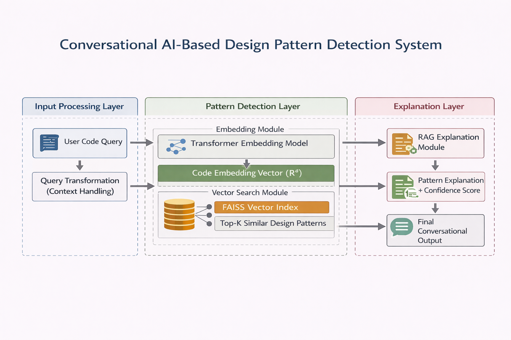
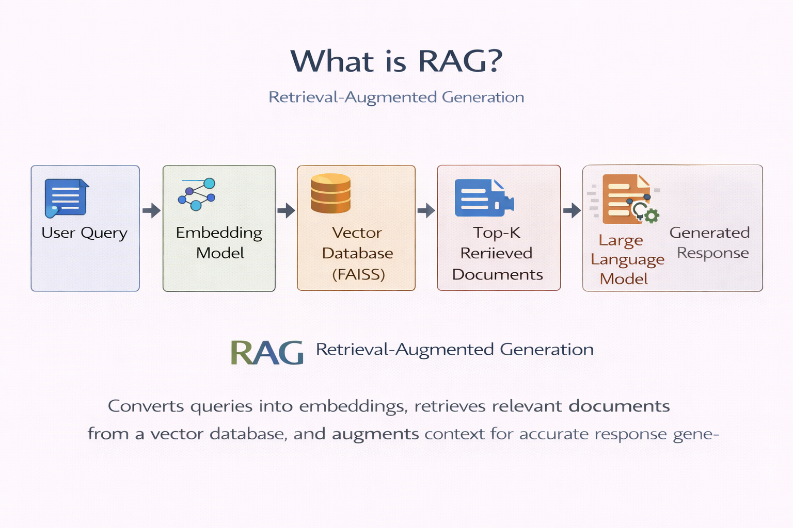

# 🧠 Conversational AI-Based Design Pattern Detection & Explanation System

## 📌 Overview

This project presents a **Conversational AI system** that detects software design patterns from user queries and generates detailed explanations using **Transformer Embeddings** and **Retrieval-Augmented Generation (RAG)**.

The system introduces **context-aware conversation**, enabling users to ask follow-up queries and receive more refined and meaningful responses.

---

## 🚀 Key Features

* 🔍 Semantic Design Pattern Detection (beyond keyword matching)
* 🧠 Transformer-based Embeddings (Sentence Transformers)
* 📚 Retrieval-Augmented Generation (RAG)
* 💬 Context-aware conversational chatbot (**key novelty**)
* ⚡ Fast similarity search using FAISS
* 📖 Supports multiple design patterns (Singleton, Factory, Observer, etc.)

---

## 🏗️ System Architecture

### 🔎 Explanation

1. User inputs a query
2. Query transformation handles conversational context
3. Transformer model converts query into embeddings
4. FAISS retrieves Top-K similar design patterns
5. RAG module generates explanation
6. Final conversational response is returned

---

## 🔄 What is RAG?

### 📖 Retrieval-Augmented Generation (RAG)

RAG improves response quality by:

* Converting queries into embeddings
* Retrieving relevant data from a vector database (FAISS)
* Using retrieved context to generate accurate responses

---

## 🧩 Tech Stack

* **Language:** Python
* **Frontend:** Streamlit
* **ML/NLP:**

  * Sentence Transformers
  * FAISS (Vector Database)
* **Concepts:**

  * Transformer Embeddings
  * Vector Similarity Search
  * Retrieval-Augmented Generation (RAG)
  * Context-Aware Chatting

---

## ⚙️ Installation & Setup

### 1. Clone Repository

git clone https://github.com/RohitIngleWork/design-pattern-chatbot-rag.git
cd design-pattern-chatbot-rag

### 2. Create Virtual Environment

python -m venv venv
source venv/bin/activate      # Mac/Linux
venv\Scripts\activate         # Windows

### 3. Install Dependencies

pip install -r requirements.txt

---

## ▶️ Run the Application

streamlit run app.py

Open in browser:
http://localhost:8501

---

## 🔄 Workflow

1. User inputs query
2. Query is transformed (context-aware)
3. Converted into embeddings
4. FAISS retrieves relevant patterns
5. RAG generates explanation
6. Conversational response returned

---

## 💡 Novelty of the Project

* ✅ Combines **Design Patterns + Conversational AI**
* ✅ Implements **context-aware chatting (main contribution)**
* ✅ Uses **RAG for dynamic explanation generation**
* ✅ More intelligent than traditional keyword-based systems

---

## 📊 Example Queries

* “Explain Singleton pattern”
* “Difference between Factory and Abstract Factory”
* “Give real-world example of Observer pattern”
* “Explain it in simple terms”

---

## ⚠️ Note

* Large files such as FAISS index and embeddings are not uploaded
* They are generated dynamically using the embedding pipeline

---

## 📈 Future Enhancements

* Add more design patterns
* Improve conversational memory
* Integrate LLM APIs (OpenAI / LLaMA)
* Add automatic code generation
* Deploy as a web application

---

## 👨‍💻 Author

**Rohit Ingle**
M.Tech (Agile Software Engineering)
MANIT Bhopal

---

## 📜 License

This project is intended for academic and research purposes.
